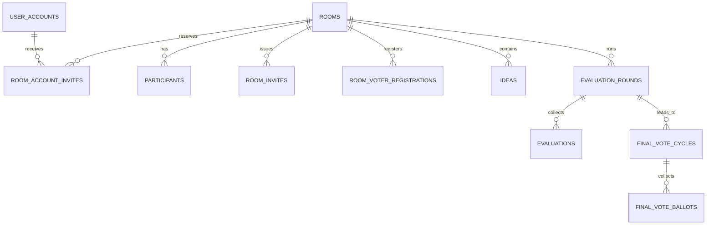

# WhyNot ERD·스키마 기준서 (V12.1)

> 기준일: 2026-08-23
> 기준 파일: `supabase_master_migration_full.sql`, `supabase/migrations/20260823_participant_invite_session_navigation_v11.sql`, `supabase/migrations/20260823_participant_voter_archive_schedule_v12.sql`, `supabase/migrations/20260823_archive_all_room_states_v12_1.sql`

## 1. 핵심 관계

`rooms`가 회의 데이터의 최상위 부모입니다. 방이 삭제되면 대부분의 회의 종속 데이터는 `ON DELETE CASCADE`로 함께 삭제됩니다. 완료된 평가·투표는 회차 테이블과 결과 스냅샷으로 보존합니다.

## 2. 테이블 목록

| 영역 | 테이블 | 역할 |
|---|---|---|
| 계정 | `user_accounts` | 로그인 아이디, 닉네임, 비밀번호 해시, 계정 상태 |
| 계정 | `user_sessions` | 서버 세션 토큰 해시와 만료 시각 |
| 계정 | `user_registrations` | 회원가입 처리 이력 |
| 회의실 | `rooms` | 단계, 정책, 외부 투표 설정, 현재 회차와 변경 버전 |
| 회의실 | `participants` | 방에 속한 참여자 또는 활성화된 외부 투표자 |
| 초대 | `room_invites` | 참여자·투표자 링크 토큰 |
| 초대 | `room_account_invites` | 가입 계정 대상 초대와 좌석 예약 상태 |
| 초대 | `room_voter_registrations` | 최종 투표 전 대기·활성 외부 투표자 |
| 아이디어 | `ideas` | 후보 원문과 현재 상태 |
| 아이디어 | `idea_versions` | 원본·익명화·보완본 버전 스냅샷 |
| 기준 | `criterion_proposals` | 참여자가 낸 익명 기준 제안 |
| 기준 | `criteria` | 확정 평가 기준 |
| 기준 | `criterion_approvals` | 기준안 승인·수정 요청 |
| 단계 | `phase_completions` | 단계별 사용자 완료 상태 |
| 단계 | `room_phase_participants` | 회차 시작 시 고정된 대상자 명단과 역할 |
| 평가 | `evaluation_rounds` | 1·2차 평가 회차와 결과 스냅샷 |
| 평가 | `evaluation_round_participants` | 평가 회차 대상자 스냅샷 |
| 평가 | `evaluations` | 아이디어별 점수·익명 피드백 |
| 평가 | `round_candidates` | 회차별 후보와 결과 |
| 평가 | `decision_votes` | 이전 의사결정 투표 호환 데이터 |
| 보완 | `candidate_feedback` | 후보 보완용 피드백 호환 데이터 |
| 보완 | `refinement_cycles` | 후보 보완 회차 호환 데이터 |
| 보완 | `refinement_cycle_votes` | 보완 회차 진행 동의 투표 |
| 감사 | `round_deadline_audit` | 마감 연장 이력 |
| AI | `ai_reports` | AI 입력·결과·모델·프롬프트 버전 스냅샷 |
| 최종 투표 | `final_vote_cycles` | 별 3개 누적 투표 회차 |
| 최종 투표 | `final_vote_ballots` | 사용자별 최종 투표지 |
| 최종 투표 | `final_roulette_consents` | 동률 룰렛 동의 |
| 최종 투표 | `final_roulette_draws` | 순차 룰렛 결과 |

V11 세션은 마지막 실제 사용자 활동 기준 24시간의 슬라이딩 만료를 사용합니다. 클릭·키 입력·터치·화면 복귀만 `/api/auth/activity`를 통해 만료 시각을 연장하고, 초대/방 상태 폴링은 세션을 연장하지 않습니다. 일반 재접속은 이전 회의실 ID를 자동 복원하지 않고 로비에서 시작하며, 새로고침과 명시적 `roomId` URL만 현재 회의실을 복원합니다.

## 3. V11 핵심 컬럼

### `rooms`

| 컬럼 | 타입 | 제약·의미 |
|---|---|---|
| `id` | `TEXT` | PK |
| `host_id` | `TEXT` | 방장 사용자 ID |
| `status` | `TEXT` | 현재 단계 |
| `max_participants` | `INT` | 방장 포함 참여자 최대 6명 |
| `external_voters_enabled` | `BOOLEAN` | 외부 투표자 사용 여부, 기본 `FALSE` |
| `required_voter_count` | `INT` | 필요 외부 투표자 수, 비활성 0·활성 1~30 |
| `final_vote_roster_locked_at` | `TIMESTAMPTZ` | 최종 투표 명단 고정 시각 |
| `state_version` | `BIGINT` | 상세 데이터 변경 감지용 증가 버전 |
| `current_final_vote_cycle_id` | `TEXT` | 현재 최종 투표 회차 |
| `final_vote_status` | `TEXT` | 최종 투표 진행 상태 |

`rooms_external_voter_settings_check`는 외부 투표 비활성 시 필요 인원을 0으로, 활성 시 1~30명으로 제한합니다.
V11의 `rooms_enforce_participant_reserved_capacity_v11` 트리거는 `max_participants`를 현재 참여자 수 + `PENDING` 참여자 계정 초대 예약 수보다 작게 낮추는 변경을 거절합니다. 초대 생성·링크 입장·계정 초대 수락과 같은 방 행 잠금 순서를 사용하므로 동시 요청에서도 예약 좌석이 유실되지 않습니다.

V11의 `participants_expire_conflicting_account_invite_v11` 및 `voter_registrations_expire_conflicting_account_invite_v11` 트리거는 공유 링크 등으로 반대 역할에 먼저 등록된 경우 같은 방의 충돌하는 `PENDING` 계정 초대를 즉시 `EXPIRED` 처리해 역할 중복과 유령 예약을 막습니다.

### `participants`

| 컬럼 | 타입 | 제약·의미 |
|---|---|---|
| `room_id` | `TEXT` | `rooms.id` FK, 방 삭제 시 연쇄 삭제 |
| `user_id` | `TEXT` | 회의 내부 사용자 ID |
| `nickname` | `TEXT` | 회의 표시 이름 |
| `role` | `TEXT` | `PARTICIPANT` 또는 `VOTER` |

기존 행은 모두 `PARTICIPANT`로 보정합니다. 외부 투표자는 최종 명단 확정 시에만 `participants`에 활성 역할로 반영됩니다.

### `room_invites`

| 컬럼 | 타입 | 제약·의미 |
|---|---|---|
| `room_id` | `TEXT` | `rooms.id` FK, 연쇄 삭제 |
| `invite_token_hash` | `TEXT` | 원문을 저장하지 않는 링크 검증 해시 |
| `invite_type` | `TEXT` | `PARTICIPANT` 또는 `VOTER` |
| `expires_at` | `TIMESTAMPTZ` | 링크 만료 시각 |
| `is_active` | `BOOLEAN` | 재발급 시 이전 링크 비활성화 |

`room_invites_one_active_type_idx`는 방·유형별 활성 링크를 하나로 제한합니다.

### `room_account_invites`

| 컬럼 | 타입 | 제약·의미 |
|---|---|---|
| `id` | `TEXT` | PK |
| `room_id` | `TEXT` | `rooms.id` FK, 연쇄 삭제 |
| `invited_login_id` | `TEXT` | 정규화된 가입 아이디 |
| `invited_user_id` | `UUID` | `user_accounts.id` FK, 계정 삭제 시 연쇄 삭제 |
| `invite_role` | `TEXT` | `PARTICIPANT` 또는 `VOTER` |
| `status` | `TEXT` | `PENDING`, `ACCEPTED`, `DECLINED`, `CANCELED`, `EXPIRED` |
| `created_by` | `TEXT` | 초대를 만든 방장 ID |
| `accepted_at` | `TIMESTAMPTZ` | 초대 수락 완료 시각 |
| `responded_at` | `TIMESTAMPTZ` | 수락·거절·취소·만료 등 초대 응답/종료 시각 |
| `membership_left_at` | `TIMESTAMPTZ` | ACCEPTED 초대 후 실제 참여 관계(참여자 탈퇴 또는 투표자 등록 취소)가 종료된 시각. 초대 이력은 보존 |

대기 중인 계정 초대는 사용자·방 단위로 중복 생성되지 않습니다. 참여자 계정 초대는 좌석을 예약하지만 로그인만으로 자동 수락하지 않습니다. 초대받은 사용자가 초대 내용을 확인하고 1~6자의 회의실 닉네임을 정한 뒤 명시적으로 수락해야 `participants`에 등록됩니다. 거절하면 `DECLINED`, 아이디어 등록 단계가 끝나면 `EXPIRED`로 종료되어 예약 좌석을 반환합니다. 투표자 계정 초대도 명시적으로 수락해야 `room_voter_registrations`에 등록되며 거절 시 예약 좌석을 즉시 반환합니다. 모든 `PENDING`→종료 상태 변경은 V11 트리거가 `responded_at`을 보장합니다.

### `room_voter_registrations`

| 컬럼 | 타입 | 제약·의미 |
|---|---|---|
| `room_id` | `TEXT` | `rooms.id` FK, 연쇄 삭제 |
| `user_id` | `TEXT` | 등록 사용자 ID |
| `nickname` | `TEXT` | 표시 이름 |
| `source` | `TEXT` | `ACCOUNT`, `LINK`, `PARTICIPANT_FALLBACK` |
| `status` | `TEXT` | `WAITING`, `ACTIVE`, `CANCELED` |
| `activated_at` | `TIMESTAMPTZ` | 최종 명단 포함 시각 |
| `hidden_at` | `TIMESTAMPTZ` | 회의 진행 상태와 무관하게 해당 사용자 개인 목록에서 보관한 시각 |

`(room_id, user_id)`가 PK입니다. 동일 계정의 중복 등록을 막고 최종 투표 시작 전까지 대기 상태로 관리합니다.

### `room_phase_participants`

| 컬럼 | 타입 | 제약·의미 |
|---|---|---|
| `room_id` | `TEXT` | `rooms.id` FK, 연쇄 삭제 |
| `phase` | `TEXT` | 예: `FINAL_VOTE:{round_id}` |
| `user_id` | `TEXT` | 고정된 대상자 |
| `role` | `TEXT` | `PARTICIPANT` 또는 `VOTER` |

최종 투표 시작 시 참여자와 활성 외부 투표자를 이 테이블에 고정합니다. 결과 공개 조건과 룰렛 동의 대상은 이 명단을 사용합니다.

### `evaluations`

| 컬럼 | 타입 | 제약·의미 |
|---|---|---|
| `room_id` | `TEXT` | `rooms.id` FK |
| `round_id` | `TEXT` | `evaluation_rounds` 복합 FK |
| `idea_id` | `TEXT` | 평가 후보 |
| `evaluator_id` | `TEXT` | 서버 내부 평가자 ID |
| `overall_score` | `SMALLINT` | 종합점수 1~10 |
| `feedback_text` | `TEXT` | 1차 필수 익명 피드백 |
| `decision` | `TEXT NULL` | 이전 평가 방식 호환용 |

평가자는 본인 아이디어를 제외한 모든 후보를 평가합니다. 같은 회차·아이디어·평가자의 중복 평가는 고유 제약으로 방지합니다.

### 최종 투표 테이블

| 테이블 | 핵심 키 | 역할 |
|---|---|---|
| `final_vote_cycles` | `id`, `room_id`, `decision_round_id` | 후보 스냅샷·스티커 수·회차 상태 |
| `final_vote_ballots` | `cycle_id`, `user_id` | 사용자당 별 3개 배분 결과 |
| `final_roulette_consents` | `cycle_id`, `user_id` | 고정 명단 전원 동의 확인 |
| `final_roulette_draws` | `cycle_id`, `draw_number` | 이미 뽑힌 후보를 제외하는 순차 추첨 기록 |

## 4. 데이터 변경 감지

`rooms.state_version`은 다음 방 종속 데이터가 `INSERT`, `UPDATE`, `DELETE`될 때 증가합니다.

- 참여자·초대·투표자 등록
- 아이디어·버전·기준·기준 제안·승인
- 단계 완료·단계별 명단
- 평가·평가 회차·후보·투표·AI 보고서
- 보완 호환 데이터·마감 이력
- 최종 별 투표·동의·룰렛 결과

프론트엔드는 `get_room_state_v9` 단일 RPC를 사용하는 가벼운 상태 API로 접근 권한과 버전을 함께 확인하고, 값이 달라졌을 때 상세 데이터를 다시 조회합니다.

계정 초대 팝업은 `list_pending_account_invites_v11`로 현재 로그인한 사용자 본인의 `PENDING` 초대만 조회합니다. 다른 초대 대상자나 회의 상세 데이터는 반환하지 않습니다.

## 5. 권한·삭제·무결성 원칙

- 신규 초대·투표자 테이블은 RLS를 켜고 `anon`, `authenticated`의 직접 접근을 제거합니다.
- 브라우저는 DB에 직접 쓰지 않고 인증된 서버 API를 사용합니다.
- 방장 검증, 좌석 계산, 최종 명단 고정은 `SECURITY DEFINER` RPC 내부에서 `rooms ... FOR UPDATE`로 원자 처리합니다.
- `room_account_invites`, `room_voter_registrations`, `room_invites`, `participants`는 방 삭제 시 연쇄 삭제됩니다.
- 평가·최종 투표의 완료 결과는 회차 스냅샷을 기준으로 재사용하며 과거 투표지를 새 회차에 재사용하지 않습니다.
- 외부 투표자는 1·2차 평가 정족수와 최소 응답 정족수에 포함하지 않습니다.

## 6. V11 데이터 조작 요약

| 동작 | 주요 테이블 | 조작 |
|---|---|---|
| 방 생성 | `rooms`, `participants`, `room_invites` | 단일 RPC `INSERT` |
| 계정 초대 | `room_account_invites` | 좌석 확인 후 `INSERT` |
| 참여자 계정 초대 수락·거절 | `room_account_invites`, `participants` | 명시적 응답 후 `UPDATE` + 필요 시 `UPSERT` |
| 투표자 초대 수락·거절 | `room_account_invites`, `room_voter_registrations` | 명시적 응답 후 `UPDATE` + 필요 시 `UPSERT` |
| 링크 입장 | `participants` 또는 `room_voter_registrations` | 잠금 후 `UPSERT` |
| 최종 투표 시작 | `participants`, `room_voter_registrations`, `room_phase_participants`, `rooms` | 명단 활성화·고정 |
| 미완료 회차 취소 | `final_vote_cycles`, `room_phase_participants`, `room_voter_registrations`, `rooms` | 이전 투표지 보존, 새 회차용 명단 재구성 |
| 최종 확정 | `ideas`, `rooms` | 단일 RPC 일괄 `UPDATE` |

## 7. V12 참여 해제·보관·예정 시간 정책

### 참여자 실제 탈퇴

- `IDEA_SUBMISSION`에서만 일반 참여자가 본인 탈퇴를 요청할 수 있으며 방장은 탈퇴할 수 없습니다.
- `leave_room_participant_v12`가 `rooms` 행을 잠근 뒤 본인의 아이디어, `IDEA_SUBMISSION` 완료 기록, 참여자 행을 하나의 트랜잭션에서 정리해 좌석을 즉시 반환합니다.
- 수락된 계정 초대는 `ACCEPTED` 이력으로 보존하고 `membership_left_at`으로 실제 참여 관계 종료를 구분합니다.
- 탈퇴는 방 단계를 자동 이동시키지 않습니다. 남은 실제 `PARTICIPANT` 2명 이상, 필요한 아이디어 수, 전원 완료 조건이 충족되면 기존과 동일하게 방장의 다음 단계 버튼만 활성화됩니다.
- `advance_idea_submission_v8`은 V12부터 `participants.role = 'PARTICIPANT'`만 단계 정족수와 완료 조건에 포함합니다. 외부 투표자는 Stage-1 진행 조건에 포함되지 않습니다.

### 외부 투표자 본인 등록 취소

- `cancel_my_voter_registration_v12`는 본인의 `WAITING` 등록만 취소합니다.
- `final_vote_roster_locked_at`이 설정되었거나 최종 투표 상태/회차가 시작된 뒤에는 취소할 수 없습니다.
- 취소 즉시 `CANCELED`가 되어 투표자 좌석을 반환하며 기존 방장 전용 투표자 관리 함수의 권한은 완화하지 않습니다.

### 개인 보관

- 새 보관 시스템을 중복 생성하지 않고 기존 `hidden_at`을 개인 목록 정리용 보관 상태로 사용합니다. 보관은 회의 진행 상태와 무관하게 가능합니다.
- 방장·참여자는 `participants.hidden_at`, 투표자-only 사용자는 `room_voter_registrations.hidden_at`을 사용합니다.
- `set_room_archive_v12`가 해당 사용자의 방 관계를 서버에서 다시 확인합니다. 보관 상태는 참여·투표 자격, 회의 단계, 데이터에 영향을 주지 않습니다.
- 보관은 방 자체나 다른 사용자의 데이터를 삭제하지 않으며 복원 가능합니다. 진행 중 방을 보관해도 탈퇴·회의 종료·단계 변경으로 처리하지 않습니다.

### 2차 투표 예정 시간

`rooms.deadlines`의 V12 표준 키는 다음과 같습니다.

| 키 | 의미 | 자동 실행 여부 |
|---|---|---|
| `finalVoteStartAt` | 2차/최종 별 투표 예정 시작 일시 | 자동 시작하지 않음 |
| `finalVoteEndAt` | 2차/최종 별 투표 예정 마감 일시 | 자동 마감·자동 확정하지 않음 |

V11의 `voteStartTime`과 `evaluationAt`은 호환 읽기 후 표준 키로 정규화합니다. 예정 시간은 운영 안내용이며 기존의 `고정 명단 전원 제출 후 결과 공개` 정책을 바꾸지 않습니다. 최종 투표가 시작되면 프론트와 서버 모두 시간 변경을 거부합니다.
